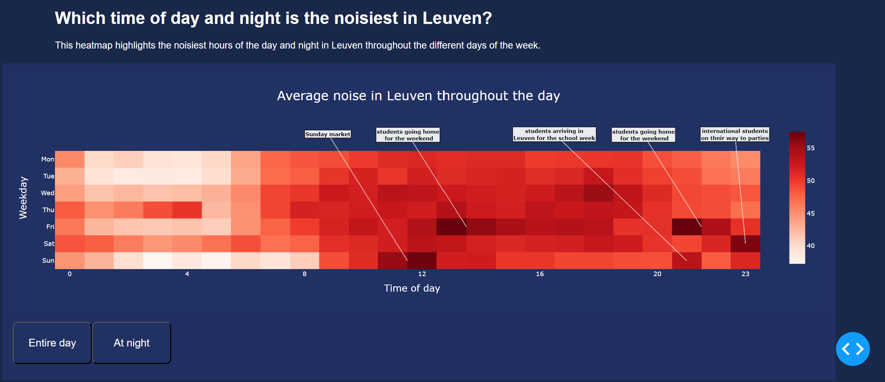

# **MDA-Georgia**

## Table of contents
- [Introduction](#introduction)
- [Data](#data)
- [Installation](#installation)
- [Usage](#usage)
- [Examples](#examples)
- [Repository](#repository)
- [Resources](#resources)
- [Authors](#authors)

--- 
## Introduction
`MDA-Georgia` is a data analytics project concerning noise in the city of Leuven, which was developed for the course 'Modern Data Analytics' at KU Leuven during the 2022-2022 academic year. The star of our project is the mda-georgia app, which has been developed with the Dash interactive Python framework developed by [Plotly](https//plot.ly/) and was deployed using Heroku. You can visit the app on https://mda-georgia.herokuapp.com/.

---

## Data  

For the project, we used noise level and noise events data, weather data, traffic data, and a small corpus of scientific articles on noise pollution. 

The noise data contains noise levels which were monitored for the entire year of 2022, for 8 different locations in the centre of Leuven. The noise events were also recorded and were assigned a certainty level and a noise source class. All the noise data was provided by KU Leuven. The weather data from 2022 was retrieved from the [Leuven.cool network](https://rdr.kuleuven.be/dataset.xhtml?persistentId=doi:10.48804/SSRN3F). We scraped the traffic data from [Telraam](https://telraam-api.net/), which is documented in detail in the notebook _ScrapingTelraam.ipynb_. Finally, we scraped some scientific articles from Pubmed central about noise pollution to highlight the importance of our research topic, which is documented in the _NLP_ folder. 
 
---

## Installation

### Built With
* [Plotly Python](https://plot.ly/python/) - Used to create the interactive plots
* [Dash](https://dash.plot.ly/) - Main server and interactive components 
* [Heroku](https://www.heroku.com/) - Used to deploy the app

### Requirements
If you want to run the app locally, we suggest you to create a separate virtual environment running Python 3.9, and install all of the required dependencies there. Run in Terminal/Command Prompt:

```
git clone https://github.com/lennertvanh/MDA-Georgia.git
cd dash-sample-apps/apps/dash-manufacture-spc-dashboard/
python3 -m virtualenv venv
```
In UNIX system: 

```
source venv/bin/activate
```
In Windows: 

```
venv\Scripts\activate
```

To install all of the required `pip` packages to this environment, simply run:

```
pip install -r requirements.txt
```

Now, you're all set to locally run the app, which will be explained in the next section.

_**IMPORTANT**_:

The app was deployed on Heroku. Since the compressed app could only take up 500MB, we were obliged to create separate requirements files to run the app and to run any file in the repository. It’s important to mention that the _**requirements.txt**_ file contains _only_ the necessary packages to locally run the app, while the _**requirements-full.txt**_ file contains _all_ the necessary packages to run the app AND succesfully run all other files in the repository. So, if you also want to run any of our notebooks, run this line in the terminal instead:

```
pip install -r requirements-full.txt
```

---

## Usage

Run this app locally by running the following code in the terminal:
```
python app.py
```
The terminal will give the message 'Dash is running on [_http link_]'. By following this link, the homepage of the app will open in your browser. You can dive in and explore the app by clicking the links at the top of the page, which are categorized under 3 titles:

1. _Explore the noise data_: these pages contain interactive visualizations concerning the noise levels and noise events data
2. _Explore the weather data_: these pages show interactive visualizations concerning the meteo data
3. _Analysis_: these pages display visualizations that combine different datasets, and contain the results of the modeling 


---

## Examples

When you visit our app, the first page you'll see is our homepage, which displays some of the most important and general statistics:


We suggest you start with 'Explore the noise data', following the order of the pages. In this section, interactive visualizations concerning the noise in the city of Leuven are shown. Here are some examples to show what you can expect:




After exploring the noise data, you can explore the weather data by clicking the pages under 'Explore the weather data', which will you some interesting plots like this one:


Finally, you can discover how noise and weather are related by visiting the pages underneath 'Analyzing noise and weather together':


Underneath the last category, you can also find our modelling page:

---

## Repository 

In this section, we provide a brief explanation of the structure and files in our repository. 

* _**assets**_: folder with CSS and graphic elements to style the app, AI generated icons for the noise map plot, images in this README file
* _**Data for modeling**_: folder with data used for modeling, split in training and test data
* _**Data for visualization**_: folder with data used for creating visualizations in the app
* _**Modelling**_: folder with jupyter notebooks of our models 
* _**NLP**_: folder with scientific articles about noise pollution, and the jupyter notebook in which we scrape them and apply basic NLP techniques 
* _**pages**_: folder with a _.py_ file for each page in the app
* _**Preprocessing.ipynb**_: jupyter notebook where we preprocessed the noise and weather data for both visualization and modelling purposes
* _**app.py**_: file where all the routes for the app are defined
* _**requirements.txt**_: file containing Python packages to run the app
* _**requirements-full.txt**_: file containing all Python packages to run the app and any other file in the repository
* _**ScrapingHolidays.ipynb**_: jupyter notebook where we scraped holidays in 2022
* _**ScrapingTelraam.ipynb**_: jupyter notebook where we scraped and preprocessed traffic data 
* _**.slugignore**_: file that indicates which files and folders in our repository should be ignored when setting up the app
* _**Procfile**_: file that indicates what needs to be done to start the app 


---

## Resources
* [Dash User Guide](https://dash.plot.ly/)
* [Weather data from Leuven.cool network](https://rdr.kuleuven.be/dataset.xhtml?persistentId=doi:10.48804/SSRN3F)
* [Coloring for Colorblindness](https://davidmathlogic.com/colorblind/#%23D81B60-%231E88E5-%23FFC107-%23004D40)
* [Coolors Color Palette](https://coolors.co/223164-132244-eb862e-2a9d8f-e6af2e)
* [OpenAI. (2023). ChatGPT (April 20 version) [Large language model].](https://chat.openai.com/)
* [Plotly Graphing Libraries](https://plotly.com/python/)
* [Telraam traffic data](https://telraam-api.net/)
* [Decibel Levels Information](https://hearinghealthfoundation.org/decibel-levels)


---

## Authors
* Grégoire Corluy - GregoireCorluy
* Ying Tian - yingtian1
* Yasemin Uslu - yasemin98
* Lennert Vanhaeren - lennertvanh
* Axl Wynants - awynants
